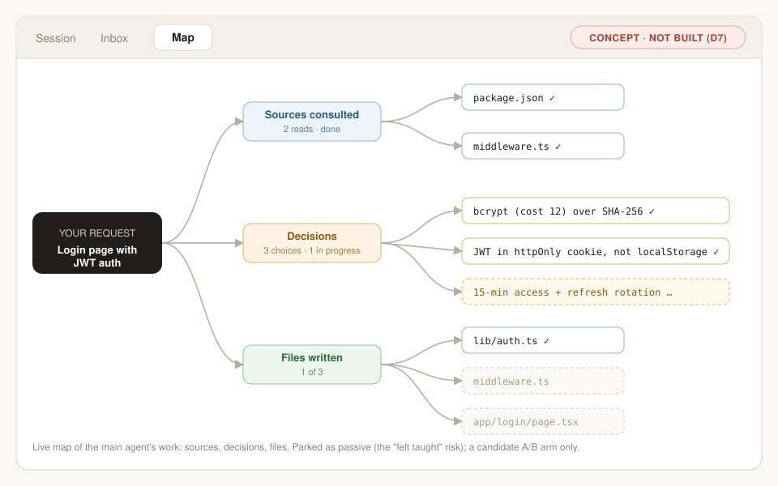

# Learn Mode — Spec (v1, prototype)

> Education Labs take-home · Option B: *Learning through collaboration with Claude*
> Status: **Draft for build** · Owner: Arvind M · Spec-driven: code changes should trace back to a section here.

---

## 1. One-liner

A **learning sub-agent** that rides alongside Claude's main agent in regular Claude. It watches the main agent's work, with read-only access, and turns it into short, grounded learning moments. The task is never interrupted, the main agent is never influenced, and the user is never made the driver.

## 2. Problem & thesis

- **We are in the open-book era.** Claude already shows its steps, its reasoning and its code, and people still skip to the answer. The steps aren't hidden; people just don't engage with them. Showing more won't fix this. Engagement has to be designed in.
- **Agents are widening the passive gap.** When an agent runs for minutes, the human sits idle (the "Chad IDE" problem: what do you do while the agent works?). That time is going to distraction today.
- **Standalone learning products lose on distribution.** A "Claude for learning" that withholds answers competes with the Claude that gives them, and loses. Learning has to live **inside the surface where the work already happens**.
- **Making the learner the driver damages the work.** If the learner steers, output quality is capped by their skill, the model spends effort executing weaker approaches, and the context fills up with the learner's uncertain choices.

**Thesis: driver vs. passenger.** A purpose-built learning app can make the user the driver. A learn-as-you-work feature inside Claude should make the user the **front-seat passenger**. The agent drives at full quality while a mentor in the passenger seat explains, asks and checks. Think of a glass-blowing show: the expert does the work while the host stands with the participant, explaining the nuances and asking questions.

**Why the moment is valuable:** the user just asked for this task, which is the strongest intent signal we will ever get. We don't have to convince them the topic matters.

## 3. Design principles

1. **No task interruptions, low friction.** Learning never blocks, slows or pauses the main agent.
2. **Strict isolation.** The learning agent can read the main agent's trajectory. The main agent does not know the learning agent exists. Learner state never enters the main agent's context.
3. **Grounded, not generic.** Every learning move is tied to a specific item in the main thread. The main agent's output is the source of truth ("the answer key").
4. **Question-first.** The learning agent asks rather than issues verdicts. This stays safe even when it lacks the main agent's full context (repos, sources, files).
5. **The user controls the learning.** They choose objectives, can dismiss nudges and can turn learn mode off. Only the user can carry anything back to the main agent.
6. **Measure learning, not the feeling of teaching.** Passive surfaces (like mind maps) create the *feeling* of having taught. We optimize for evidence of retrieval and transfer.
7. **Memory makes the agent good.** Mastery estimates, an evidence timeline and episodes drive what the agent does next.

## 4. Decision log (locked in brainstorm)

| # | Decision | Rationale |
|---|---|---|
| D1 | **Option B** (general learning) over A (customer education) | Higher ceiling for what AI can do for learning. |
| D2 | Build **inside regular Claude behind a feature flag** (`learnMode`), not as a separate surface | Distribution; learners default to the low-friction surface; A/B testable from day 1. |
| D3 | **Learning sub-agent (LSA) with read-only access to the main agent (MA). MA is unaware of LSA.** 1 main thread : N learning sessions | Protects output quality and context; enables revisits and spaced repetition per thread. |
| D4 | **Prediction/explain-back is the core loop**; probe, hint, explain, demonstrate/remix are supporting moves | Committing to an answer before feedback builds durable memory. The MA's output supplies the feedback. |
| D5 | **Main output is never altered** (no gating, blurring or collapsing). Only anchor links point into it | Open-book reality: hiding answers doesn't change behavior and adds complexity. The LSA may be a cheaper model. |
| D6 | **Learn mode can start mid-task or after the task** ("before you review the agent's work…") | Removes dependence on idle time. The idle window is a bonus, not a precondition. |
| D7 | **Mind-map tab parked** as a future A/B arm; not in v1 | Passive; high risk of "felt taught, didn't learn." Most users won't click nodes. |
| D8 | **MA-mistake detection is an edge case** ("misprint in the textbook"). No special flow; measured via evals | The LSA lacks the MA's sources, so it can't reliably judge. Question-first framing keeps it safe. |
| D9 | **Refresher triggers: combined policy** (direct recurrence, then interleaving/adjacency, then low mastery + due) | Spaced repetition plus interleaving are among the strongest effects in learning science. |
| D10 | **LLM grades, code updates memory** | Consistent, auditable mastery numbers; graders can be evaluated. |
| D11 | **Real Claude call for the MA, pacing mocked**, labelled with a visible *Prototype note* | Honest demo of agent-length work without building a full agent loop. Reviewers can type their own tasks. |
| D12 | Demo scenario: **"Build an auth page"** (JWT, password hashing, refresh tokens) | Concrete, clear sub-topics, natural interactive widget (JWT decoder). |
| D13 | Stack: **Next.js on Vercel**, API key server-side, learner memory in `localStorage` | Fast to build, easy for reviewers to use. |
| D14 | **LSA pre-empts the MA.** It starts from the user's prompt, predicts what the MA's work will involve, and asks the learner to reason ahead (incl. *approach* questions like "which files would you look at?"). As MA items arrive it **cross-verifies** its predictions and the learner's answers against them | Real agents spend most of their time on tool calls and source gathering, which is lookahead the LSA can use. We teach the *reasoning* behind the approach, never the tool calls themselves. |
| D15 | **MA reasoning is streamed for real** (summarized thinking) while it works; only the reveal of the final steps is paced | Honest, chat-app-like experience during the 30–60 s wait. The stream also gives the LSA early signal. |
| D16 | **Widgets are generated freely by Opus** (sliders and interactive HTML). **Quizzes (MCQ, etc.) use templates** | Opus reliably builds small interactive HTML. Templates keep assessments consistent and gradeable. We pre-test on the demo path. |
| D17 | **Prototype polish focuses on one journey: the auth page.** Other suggested tasks work but aren't tuned | The brief asks for depth on one interaction pattern. The design is general; the demo is specific. |

## 5. User journeys

### J1 — Live: learn while the agent works (primary demo)
1. The user picks the suggested task "Build a login page with JWT auth for my Next.js app" and sends it.
2. The MA starts working. Its summarized reasoning streams live (real), then steps appear one by one (plan, then files, then notes) at a paced speed. A *Prototype note* explains the pacing.
3. Under the user's prompt a chip appears: **"🎓 Learn while Claude builds this: JWT auth, password hashing"**. It appears only if the task is learnable and the topics aren't already mastered (§11).
4. The user clicks it. `learnMode` turns on, the right panel opens (3-panel layout) and the LSA offers 2–3 **suggested learning objectives** (e.g. *How JWTs are structured and signed*, *Why bcrypt and not SHA-256*, *Refresh-token rotation*).
5. The user picks one. The LSA **pre-empts the MA** (D14). While the MA is still reasoning, it asks an *approach* question, often as multiple choice: *"If you were building this in an existing Next.js repo, which files would you look at first?"* (options: `middleware.ts`, `package.json`, `app/layout.tsx`, `.env`, `README.md`…). When the MA's own steps arrive, the LSA shows which files the MA actually went to and why.
6. Next, a **prediction probe anchored to an upcoming step**: *"Claude is about to write `verifyToken()`. Before it does: which parts of a JWT does the server need to check, and why?"*
7. The user answers. The grader scores the answer, memory updates, and the LSA gives short feedback that **links to the MA step** where the answer is revealed (anchor ↗ scrolls and highlights that step).
8. The LSA follows with a supporting move chosen by mastery (e.g. `demonstrate` renders an interactive **JWT decoder/tamper widget** built from the token format the MA actually used).
9. The session ends when the objective is covered, or when the user closes the panel. An episode is written to memory.

### J2 — Post-task: learn before you review
1. The MA finishes (fast task, or the user ignored the live chip).
2. A completion chip reads: **"Claude built this auth flow. Want to understand it before you review it? (~3 min)"**
3. Same loop as J1. Predictions become **explain-back / what-if** probes, since everything is already visible: *"If the server skipped checking `exp`, what attack becomes possible?"*

### J3 — Refresher (spaced repetition + interleaving)
1. Some days later (simulated in the prototype with a **"⏩ +3 days"** control, labelled as a prototype note), the top-bar **learning badge** shows an unread count.
2. Clicking it opens the panel's **Inbox**: refresher cards like *"Refresher: JWT signature verification · from 'Build auth page' · mastery ~0.45"*.
3. Opening a card opens the **original main thread** and starts a **new learning session** on it (1:N). The session is 1–3 retrieval questions anchored to that thread's items.
4. **Contextual trigger:** if the user starts a new task on a related topic (e.g. "add rate limiting to the login API"), the refresher surfaces inline as a single dismissible chip (§10).

### J4 — Trivial ask: stay out of the way
"What's the capital of France?" gets an instant answer with no pacing and no learn chip. This shows the system knows when *not* to teach.

## 6. UI

**Layout:** a Claude-like 3-panel layout once learn mode is open. Otherwise it's 2-panel.

```
┌───────────────────────────────────────────────────────────────────────────┐
│ Top bar:  [model]                       🎓 Learn mode [toggle]  (🔔 2)    │
├────────────┬──────────────────────────────────────┬───────────────────────┤
│ Chats &    │  Main thread                         │  Learning panel       │
│ tasks      │  ┌ user prompt                       │  [Session] [Inbox]    │
│            │  │  🎓 Learn while Claude builds…    │                       │
│            │  ├ step 1  Plan            #s1       │  Objectives ○ ● ○     │
│            │  ├ step 2  auth.ts         #s2 ◀─────┼─ anchor highlight     │
│            │  ├ step 3  middleware.ts   #s3       │  Probe / feedback     │
│            │  └ ⓘ Prototype note: paced to        │  Widget (iframe)      │
│            │     simulate a long agent run        │  Mastery mini-view    │
│            │  [ input  ▸ suggested tasks ]        │  [ reply input ]      │
└────────────┴──────────────────────────────────────┴───────────────────────┘
```

- **Top bar:** a persistent Learn-mode toggle (discovery arm A) and a notification badge with the count of due refreshers.
- **Inline chips** under the prompt or completion (discovery arm B). Copy is framed as a level-up, never as remedial.
- **Learning panel tabs:**
  - **Session:** objectives, the conversation with the LSA, rendered widgets, a small "what you've shown so far" strip.
  - **Inbox:** refresher cards (spaced repetition) and past sessions for this thread.
  - *(Parked, D7: Map tab.)*
- **Memory view:** a "Your learning" drawer (from the panel footer) showing topics with mastery bars, an evidence timeline per topic and open misconceptions. This is what we show in the video to make the memory legible.
- **Anchors:** every LSA message carries 0–n anchor chips (`auth.ts · step 2 ↗`). Clicking one scrolls the main thread and highlights that item for about 2 s.
- **Suggested tasks:** focusing the empty input shows 4–5 suggestions (§12).
- **Prototype notes:** small, muted ⓘ callouts wherever behavior is simulated (pacing, the time-skip control, the memory store).

## 7. Architecture

```
            ┌──────────────────── browser ─────────────────────┐
            │  Thread store (items w/ stable IDs)               │
 user ───▶  │  Pacer (reveals MA steps on a schedule)           │
            │  Learner memory (localStorage)                    │
            │  Event log (instrumentation)                      │
            └──────┬───────────────┬───────────────┬────────────┘
                   │               │               │
          /api/main│      /api/learn│      /api/grade│
                   ▼               ▼               ▼
            Main agent       Learning agent     Grader
            (MA)             (LSA, tool loop)   (rubric → verdict)
            sees: thread     sees: read-only    sees: probe, answer,
            only             trajectory +       anchored items
                             learner state
```

### 7.1 Isolation invariant (D3)
- `/api/main` receives **only** the main thread's user/assistant messages. It never receives learner memory, LSA messages or learn-mode state. This is enforced by separate request builders in separate modules (`lib/main/*` vs `lib/learn/*`), plus a unit test asserting the MA payload builder has no learner fields.
- The LSA gets a **read-only snapshot** of the trajectory: the item array with IDs, revealed status and content.
- Nothing flows from the LSA to the MA. If the user wants to act on something they learned, they type it into the main input themselves.

### 7.2 Thread items & stable IDs
Every renderable unit in the main thread is an item with an ID. Evidence, episodes and anchors reference these IDs.

```ts
type ThreadItem = {
  id: string;            // `${threadId}:${messageId}#s${n}`  e.g. "t_7f3:m2#s3"
  threadId: string;
  messageId: string;
  kind: "user_prompt" | "plan" | "reasoning" | "file" | "command" | "note" | "answer";
  title: string;         // "middleware.ts", "Plan", …
  content: string;       // markdown / code
  lang?: string;
  revealed: boolean;     // pacing state
  revealedAt?: number;
};
```

### 7.3 Models (env-configurable)
| Role | Default | Notes |
|---|---|---|
| Main agent | `claude-opus-5` | Adaptive thinking; structured output of steps. Server-side refusal fallbacks enabled. |
| Learning agent | `claude-sonnet-5` | Tool loop; cheaper per D5 and cost at scale (§15). |
| Widget builder | `claude-opus-5` | Generates `demonstrate` HTML from the LSA's widget spec (D16). |
| Grader | `claude-sonnet-5` | Structured output, rubric-based. |
| Learnability / pacing classifier | `claude-haiku-4-5` | Single short call; can be merged into the MA call if latency allows. |

## 8. Main agent (MA)

- **One real Claude call** per user turn to `/api/main`, using structured output:
  ```ts
  { complexity: "trivial" | "task",
    steps: Array<{ kind, title, content, lang? }>,   // 1 step if trivial
    summary: string }
  ```
- **Reasoning stream (real, D15):** the call streams with `thinking: {type: "adaptive", display: "summarized"}`. Summarized reasoning renders live in a collapsible "Thinking…" block at the top of the MA response (like current chat apps) and is stored as a `reasoning` thread item. The LSA can read it as it arrives.
- **Pacing (mocked, D11):** once the final structured output arrives, the client reveals steps on a schedule. There's a thinking shimmer before each step, and the delay depends on the step's kind and size (roughly 1.5–6 s; `file` steps take longer). `trivial` means reveal immediately with no pacing. A *Prototype note* is attached to paced responses: *"Steps are revealed at a simulated agent pace. The real agent loop is out of scope for this prototype."*
- The **full response is available before reveal** (because pacing is mocked). The LSA may see unrevealed items, which gives it the lookahead that a real agent's plan would provide (§9.4).
- The MA system prompt is plain "helpful coding assistant". **No mention of learning.**

## 9. Learning sub-agent (LSA)

### 9.1 Context assembly
```
context = system instructions
        + curriculum context        (topic graph slice for the objective)
        + learner state             (mastery, misconceptions, prefs for relevant topics)
        + current objective
        + main-agent trajectory     (read-only items w/ IDs + revealed flags)
        + recent interaction        (this session's turns)
        + relevant evidence         (last k evidence rows for the topics)
        + pedagogical strategy      (chosen by code from mastery band, §9.3)
        + tools
```
Assembled by code in `lib/learn/context.ts`. Stable parts go first so they can be prompt-cached.

### 9.2 Tools
All tool outputs render in the panel. Every tool takes `anchors: string[]` (thread item IDs) and must include at least one, except `suggest_objectives`.

| Tool | Purpose | Key input |
|---|---|---|
| `suggest_objectives` | Offer 2–3 objectives drawn from the trajectory, excluding mastered topics | `objectives[{topicId, label, why}]` |
| `probe` | **Core loop.** Ask an approach, prediction, explain-back or what-if question. Waits for the user's answer | `question, mode: approach\|predict\|explain_back\|what_if, format: free_text\|mcq, options?, topicId, anchors, rubric` |
| `hint` | Scaffold after a wrong or partial answer, or on request. Never gives the answer | `hint, topicId, anchors` |
| `explain` | Short, grounded explanation (≤120 words) using the MA's actual code | `explanation, topicId, anchors` |
| `demonstrate` | Request an interactive widget grounded in the MA's artifact, e.g. a JWT decoder/tamper tool or a bcrypt cost-factor slider. The HTML is **generated by Opus** in a separate call (D16) | `title, spec, topicId, anchors` |
| `end_session` | Wrap up: one-line recap plus what's next | `recap, nextTopicIds` |

**Pre-emption (D14).** Before or early in the MA run, the LSA works from the user prompt plus the streamed reasoning. It predicts which sub-problems, files and decisions the MA will touch, and uses `approach`/`predict` probes on them. Each prediction is stored as a *pending expectation* and **cross-verified** when the matching MA item arrives: the LSA confirms or corrects both its own expectation and the learner's answer, anchored to the real item. Approach questions are about *where to look and why*, not about tool mechanics.

**Formats:** `mcq` probes render from a template (options, single/multi select, reveal-with-anchor) and are graded deterministically where possible. `free_text` probes go to the grader.

The `probe` rubric is written by the LSA and passed to the grader, so the answer key comes from the trajectory.

### 9.3 Pedagogical strategy (code-selected)
| Mastery band | Strategy passed to the LSA |
|---|---|
| unknown / < 0.3 | Brief `explain` or `demonstrate` first, then an easy `probe` (explain_back) |
| 0.3 – 0.7 | `probe` (predict / what_if) first; `hint` on miss; `explain` only after 2 misses |
| > 0.7 | One stretch `probe` (what_if/transfer) or skip the topic; suggest an adjacent topic (interleave) |
| open misconception | Target it directly with a contrasting what_if probe |

### 9.4 Behavioral rules (system prompt)
- **Never teach tool mechanics.** Ask about the reasoning behind an approach (where to look, what to check), not about which tool the MA called.
- **Never reveal an unrevealed item's content.** Predict probes reference upcoming items by title only ("Claude is about to write `verifyToken()`…").
- **Question-first, no verdicts on the MA's work.** Frame design choices as "why do you think it chose X over Y?" (D8).
- **Grounded:** refer to the MA's actual identifiers, files and values. No generic tutorials.
- **Brief:** at most one question per turn, and messages of 120 words or fewer (excluding widgets).
- **Respect dismissal:** if the user ignores a probe for N MA steps, don't re-ask. Fade to a passive recap offer.

### 9.5 Triggers (when the LSA runs)
- Learn mode is enabled (live or post-task), leading to `suggest_objectives`.
- **The user prompt is sent while learn mode is on.** The LSA starts pre-emption immediately, in parallel with the MA (D14).
- A reasoning chunk arrives. Batched, it is used only to refine pending expectations and never shown verbatim.
- The user picks an objective or replies.
- A **new MA item is revealed** while a session is active. The LSA may choose to act (e.g. follow-up on a prediction now revealed). It's debounced and runs at most once per revealed item.
- A refresher card is opened.

## 10. Learner memory

Stored in `localStorage` under `learnMode.v1`. The schema is designed to move server-side unchanged.

```ts
type LearnerMemory = {
  topics: Record<TopicId, { label: string; parent?: TopicId; related: TopicId[] }>;
  mastery: Record<TopicId, {
    estimate: number;        // 0..1
    attempts: number;
    lastSeen: number;
    nextDue: number | null;  // spaced repetition
    intervalIdx: number;
  }>;
  evidence: Array<{          // timeline of assessments
    id: string; topicId: TopicId; sessionId: string;
    threadItemRefs: string[];            // anchors (stable IDs, §7.2)
    probe: string; mode: ProbeMode; answer: string;
    verdict: "correct" | "partial" | "incorrect";
    hinted: boolean; misconceptionTag?: string; ts: number;
  }>;
  episodes: Array<{          // one per learning session
    id: string; threadId: string; trigger: "live" | "post_task" | "refresher" | "contextual";
    topicIds: TopicId[]; startedAt: number; endedAt?: number;
    masteryBefore: Record<TopicId, number>; masteryAfter: Record<TopicId, number>;
    recap?: string;
  }>;
  misconceptions: Array<{ topicId: TopicId; tag: string; description: string;
                          firstSeen: number; lastSeen: number; resolved: boolean }>;
  preferences: { toolEngagement: Record<ToolName, { shown: number; engaged: number }>;
                 dismissals: number };
};
```

### 10.1 Grading and update (D10)
- **Grader (LLM)** receives the probe, the rubric, the anchored items and the answer. It returns `{verdict, misconceptionTag?, rationale}`.
- **Mastery update (code):** `estimate += α · (target − estimate)` where `target = 1 / 0.5 / 0` for correct/partial/incorrect and `α = 0.35` (predict/what_if) or `0.25` (explain_back). The target is ×0.7 if hinted. Clamp to 0..1. This is simple and legible, and it can be swapped for BKT/Elo later.
- **Misconceptions:** an incorrect answer with a tag upserts a misconception. A later correct answer on a probe targeting the same tag marks it resolved.

### 10.2 Spaced repetition schedule
- Intervals (days): `[1, 3, 7, 16, 35]`. A correct answer on a refresher advances `intervalIdx`, partial keeps it, incorrect resets it to 0.
- `nextDue` is set after each session for every touched topic with estimate < 0.9.
- **Simulated clock:** `now()` = real time + `timeOffset` (the "+3 days" control). Everything that uses time reads `now()`.

### 10.3 Refresher trigger policy (D9), in priority order
1. **Direct recurrence:** a new MA task touches a topic with memory, so show an inline refresher chip before or while the MA runs.
2. **Interleaving / adjacency:** a new task touches a `related` topic, so offer one cross-topic question ("You learned JWT expiry. How does that interact with rate-limiting login attempts?").
3. **Due + low mastery:** `nextDue ≤ now()` and estimate < 0.7, so the item goes in the Inbox and increments the badge.

Guardrails: at most **one** inline nudge per task, always dismissible. Three consecutive dismissals halve nudge frequency (logged to preferences).

## 11. Discovery & entry points

- **Learnability check** (runs with the MA call or a Haiku side call): `{learnable: boolean, topics: [{id,label}]}`. Show the chip only if learnable **and** at least one topic has estimate < 0.7 or is unknown.
- **Entry points:**
  1. The inline chip under the prompt (live).
  2. The completion chip (post-task).
  3. The top-bar toggle.
  4. The badge/Inbox.

  All are behind the `learnMode` feature flag.
- **Copy rules:** frame as a level-up ("Go deeper: refresh-token rotation"). Never recommend topics already mastered.
- **Experiment arms (documented, one shipped):** a persistent top-bar toggle vs inline chips only vs a mode in the model/mode selector. In the prototype, both toggle and chips are on, with `?arm=` query param support if time allows.

## 12. Suggested tasks (input focus)

1. **Build a login page with JWT auth for my Next.js app** *(primary demo)*
2. Write a SQL query for monthly user retention cohorts
3. Add rate limiting to my Express login endpoint *(shows interleaving with #1)*
4. Implement a debounced search box in React
5. What's the capital of France? *(shows J4: no pacing, no chip)*

Only #1 is tuned and pre-tested end to end (D17). The others run through the same pipeline untuned.

## 13. Instrumentation (product analytics)

Events go to an in-app event log (a debug drawer, plus `console`). A real build would send them to the analytics pipeline.

`learn_chip_shown / _clicked / _dismissed {placement, arm}` · `learn_toggle_changed {on, source}` · `objective_suggested / _selected` · `probe_shown / _answered / _ignored {mode, topicId}` · `grade {verdict, hinted}` · `tool_rendered / tool_engaged {tool}` · `anchor_clicked` · `widget_interacted` · `refresher_shown / _opened {trigger}` · `badge_opened` · `session_started / _ended {trigger, durationMs, probes, correct}` · `time_skipped`

## 14. Evals (QA for LSA behavior)

Specified here. A small harness (`evals/`) is a stretch goal. Each is an LLM-judge or code check over recorded sessions:

| Eval | Check |
|---|---|
| **Groundedness** | Does the explanation/hint refer to the MA's actual code/identifiers? Not over-generalized? |
| **Hint ≠ answer** | Hints don't give away the rubric answer. |
| **No leak** | Predict probes don't reveal unrevealed item content. |
| **Anchor validity** | Anchors exist and are relevant to the message (code check plus judge). |
| **Grader agreement** | Grader verdicts vs a small human-labelled set (target ≥ 85% agreement). |
| **Misprint edge case (D8)** | Seed MA outputs with (a) real mistakes and (b) apparent mistakes that are correct given the sources. Measure confident false claims by the LSA (target ≈ 0) and how often a real mistake is surfaced as a question. |
| **Pre-emption accuracy** | Share of LSA expectations that match what the MA actually did; approach MCQ options are plausible and the correct ones are grounded in MA items. |
| **Widget reliability** | Generated widgets render without errors and the interaction works (pre-tested on the demo path). |
| **Restraint** | Trivial tasks produce no chip; mastered topics are not re-suggested. |

## 15. Success metrics

- **North star: delayed retrieval accuracy on refreshers.** First-attempt accuracy on spaced/contextual probes taken in a *later session and a different task* than where the topic was learned. It measures retention and transfer, not engagement.
- **Learning curve:** mastery trajectory per topic from the evidence timeline, and misconceptions resolved over time.
- **Adoption funnel:** chip shown, then clicked, then first probe answered, then session completed. Compared across discovery arms.
- **Guardrails:** main-task completion time and satisfaction unchanged vs control (the isolation should guarantee this). Toggle-off rate. Nudge dismissal rate.
- **Offline:** a pre/post no-AI mini-assessment in a user study.

## 16. Scaling notes (for the write-up)

- **Domain-general by construction.** Topics come from the trajectory, not a hand-built curriculum. The curriculum context can be enriched per domain over time.
- **Cost:** the LSA runs only when learn mode is on. The cheap model does watching and deciding when to step in; heavier generation (widgets) runs only on engagement. Stable context goes first for prompt caching.
- **Memory:** the schema is designed to move from `localStorage` to Claude's memory system per user. Evidence rows are small and append-only.
- **Segments:** students get learn mode on by default. Professionals get it off, with chips and a nudge budget. Enterprise/education admins can set defaults.
- **Rollout:** feature flag, then A/B on discovery arms, then graduation based on the north star plus guardrails.

## 17. Tech & structure

- Next.js (App Router) + TypeScript + Tailwind, deployed on Vercel. `@anthropic-ai/sdk` on server routes only. `ANTHROPIC_API_KEY` is an env var.
- Widgets render in `<iframe sandbox="allow-scripts">` (no same-origin) via `srcdoc`.
- Basic per-IP rate limiting on API routes (public demo).

```
app/
  page.tsx                 # 3-panel shell
  api/main/route.ts        # MA call (structured steps)
  api/learn/route.ts       # LSA tool loop step
  api/grade/route.ts       # grader
lib/
  main/                    # MA prompt + payload builder (no learner imports)
  learn/                   # context assembly, tools, strategy, prompts
  memory/                  # schema, store, mastery update, SR schedule, triggers
  thread/                  # items, IDs, pacer
  analytics.ts
components/                # TopBar, Thread, LearnPanel, Inbox, MemoryDrawer, Widget, Chips
evals/                     # stretch
```

## 18. Build plan (milestones and acceptance)

| M | Scope | Done when |
|---|---|---|
| M1 | Shell + MA | Suggested tasks; real MA call with streamed summarized reasoning; steps revealed with pacing plus a prototype note; trivial tasks instant; item IDs visible in the DOM |
| M2 | LSA core loop | Learnability chip; learn toggle opens panel; objectives; pre-emptive approach MCQ, cross-verified when MA steps arrive; predict probe anchored to an upcoming step; answer graded; feedback anchors scroll and highlight |
| M3 | Memory | Mastery/evidence/episodes/misconceptions persisted; Memory drawer shows mastery bars and timeline |
| M4 | Supporting moves | hint / explain / demonstrate (Opus-generated JWT/bcrypt widgets in a sandboxed iframe); MCQ template; post-task entry (J2) |
| M5 | Refreshers | +3 days control; badge and Inbox; open a card to start a new session on the old thread; contextual chip on a related task |
| M6 | Polish & ship | Instrumentation log; deploy to Vercel; README; seeded demo path verified end to end |
| M7 | Stretch | Eval harness for groundedness / no-leak / misprint; discovery `?arm=` |

## 19. Considered, not built: the Mind-Map tab



The original whiteboard had a second panel tab: a live **mind map of the MA's work**, with nodes for the plan, sources consulted, decisions and files, growing as the agent works. It is the most "follow-along" way to show agent work.

**Why it's parked (D7):**
- It's a *passive* surface. It gives the product the feeling of having taught without evidence the learner learned.
- Given the choice, most users follow along instead of engaging. Merging it with the learning tab ("click a node to learn") doesn't help, because most users won't click.
- It competes with the active loop for attention during the same idle window.

**When we'd revisit it:** as an A/B arm against the active loop, measured on the north star (§15), not on engagement. It may earn its place for users who opt out of active learning but still want to understand what the agent did before reviewing it.

## 20. Design process note

The brainstorm was run with several frontier models (Claude, OpenAI, Google, Meta). **All of them converged on roughly the same first idea:** put the user in the driver's seat inside the task by pausing the agent at decision points ("forks"), asking the user to choose, and running with their choice. Claude's first proposal in this repo's transcript was exactly that.

We rejected it. It caps output quality at the learner's skill, fills the working agent's context with the learner's uncertain choices, and makes the model execute approaches it wouldn't choose. It also presumes users want friction in their day-to-day tool, which the distribution argument (§2) says they don't. The final design (a read-only, isolated learning sub-agent with the user as front-seat passenger) came from pushing back on that shared default. The sparring is preserved in the transcript.

## 21. Out of scope (v1)

A real agent loop and tool calls in the MA · the mind-map tab (D7, §19) · accounts and server-side memory · a special "MA made a mistake" flow (D8) · multi-user/shared state · mobile layout beyond basic responsiveness.

## 22. Open questions

*Resolved:* MA latency of 30–60 s is accepted, with the reasoning streamed (D15). The Map tab is documented only (§19). Widgets are generated and quizzes templated (D16).

1. MCQ answer key for `approach` probes: in a real repo the MA's file reads are ground truth. In the prototype (no real repo) the MA's plan and file steps serve as the key. Is that acceptable for the demo?
